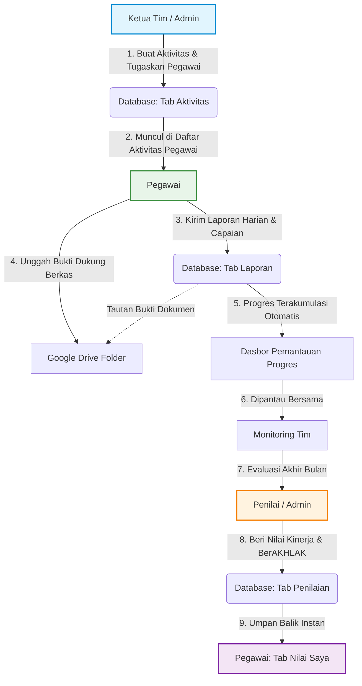

# 📘 Panduan Alur Kerja Aplikasi Manajemen Kinerja Tim
### BPS Kabupaten Puncak

Dokumen ini menjelaskan alur kerja dari perencanaan aktivitas, pelaporan harian oleh pegawai, hingga penilaian bulanan (Kinerja & BerAKHLAK) oleh penilai.

---

## 👥 Hak Akses Berdasarkan Peran (Role)

Untuk memahami alur kerja, berikut adalah hak akses dari masing-masing peran di aplikasi:
*   **Admin**: Mengelola pengguna & peran, serta memiliki semua hak akses Ketua Tim & Penilai.
*   **Ketua Tim**: Membuat aktivitas program, menugaskan pegawai, dan memantau capaian progres tim.
*   **Penilai**: Melakukan penilaian bulanan (Kinerja & nilai BerAKHLAK ASN) untuk seluruh pegawai.
*   **Pegawai**: Melihat aktivitas yang ditugaskan, mengirimkan laporan harian beserta bukti dukung, dan melihat rekap penilaian bulanan miliknya.
*   **Tamu**: Pengguna baru yang mendaftar secara mandiri dan sedang menunggu persetujuan Admin.

---

## 📊 Diagram Alur Kerja (Workflow Diagram)

---

## 🚶‍♂️ Langkah demi Langkah Alur Kerja

### 1. Tahap Perencanaan (Oleh: Ketua Tim / Admin)
Sebagai pemimpin tim, Ketua Tim menyusun rencana aktivitas kerja:
1.  Buka tab **Aktivitas**.
2.  Klik tombol **Tambah Aktivitas**.
3.  Tentukan hierarki program kerja:
    *   **Tujuan** -> **Sasaran** -> **IKU** -> **Kegiatan** -> **Sub Kegiatan** (opsi ini sudah terintegrasi dari referensi BPS).
4.  Masukkan rincian aktivitas:
    *   **Nama Aktivitas**: Judul tugas spesifik yang akan dikerjakan.
    *   **Target & Satuan**: Jumlah output yang ditargetkan (misal: `100` satuan `dokumen`).
    *   **Periode Mulai & Selesai**: Rentang waktu pengerjaan.
    *   **Ditugaskan Kepada**: Pilih satu atau lebih nama Pegawai yang bertanggung jawab atas tugas ini.
5.  Klik **Simpan**.

---

### 2. Tahap Pelaporan Harian (Oleh: Pegawai)
Pegawai yang telah ditugaskan melakukan pengerjaan dan melaporkan progresnya setiap hari:
1.  Buka tab **Aktivitas Saya**. Pegawai akan melihat daftar aktivitas yang ditugaskan kepada mereka lengkap dengan bar progres capaian.
2.  Klik tombol **Laporkan** pada aktivitas yang ingin dilaporkan.
3.  Isi formulir laporan harian:
    *   **Tanggal**: Tanggal pengerjaan aktivitas.
    *   **Jumlah Capaian**: Berapa target yang berhasil diselesaikan pada hari itu (misal: `5` dokumen).
    *   **Uraian Laporan**: Penjelasan singkat pekerjaan yang dilakukan.
    *   **Tipe Bukti**: Pilih **File** (unggah dokumen/gambar) atau **Link** (tautan luar, misal Google Drive/SharePoint).
    *   **File Bukti** (jika tipe bukti adalah file): Pilih berkas bukti dukung dari perangkat. Berkas akan otomatis terunggah ke Google Drive kantor secara aman.
4.  Klik **Kirim Laporan**.
5.  *Progres Bar* aktivitas tersebut di dasbor akan otomatis bertambah secara akumulatif.

---

### 3. Tahap Penilaian Bulanan (Oleh: Penilai / Admin)
Di akhir bulan, Penilai melakukan evaluasi menyeluruh terhadap kinerja dan perilaku pegawai:
1.  Buka tab **Penilaian Bulanan**.
2.  Pilih **Bulan Evaluasi** (misalnya: `Juli 2026`).
3.  Aplikasi akan membagi pegawai menjadi dua kelompok:
    *   🔴 **Belum Dinilai**: Pegawai yang belum mendapatkan nilai evaluasi pada bulan tersebut.
    *   🟢 **Sudah Dinilai**: Pegawai yang telah dievaluasi.
4.  Klik tombol **Beri Nilai** pada pegawai yang berada di daftar *Belum Dinilai*.
5.  Isi formulir penilaian bulanan:
    *   **Nilai Kinerja**: Pilih salah satu skala (*Sangat baik, Baik, Cukup baik, Tidak baik*).
    *   **Nilai Aspek BerAKHLAK**: Berikan penilaian rating berupa skala `1` s.d `5` untuk masing-masing dari 7 pilar Core Values ASN:
        1.  *Berorientasi Pelayanan*
        2.  *Akuntabel*
        3.  *Kompeten*
        4.  *Harmonis*
        5.  *Loyal*
        6.  *Adaptif*
        7.  *Kolaboratif*
    *   **Catatan Evaluasi**: Berikan rekomendasi/catatan tertulis bagi pegawai bersangkutan.
6.  Klik **Simpan Penilaian**.

---

### 4. Tahap Umpan Balik (Oleh: Pegawai / Ketua Tim)
Setiap pegawai (termasuk Ketua Tim) dapat melihat hasil penilaian penilai secara transparan:
1.  Buka tab **Nilai Saya**.
2.  Pilih **Bulan** penilaian yang ingin dilihat.
3.  Pegawai dapat melihat:
    *   Skor Kinerja Bulanan.
    *   Grafik Radar/Rincian Nilai Karakter BerAKHLAK.
    *   Catatan evaluasi dan saran dari Penilai untuk perbaikan kualitas kerja di bulan berikutnya.
