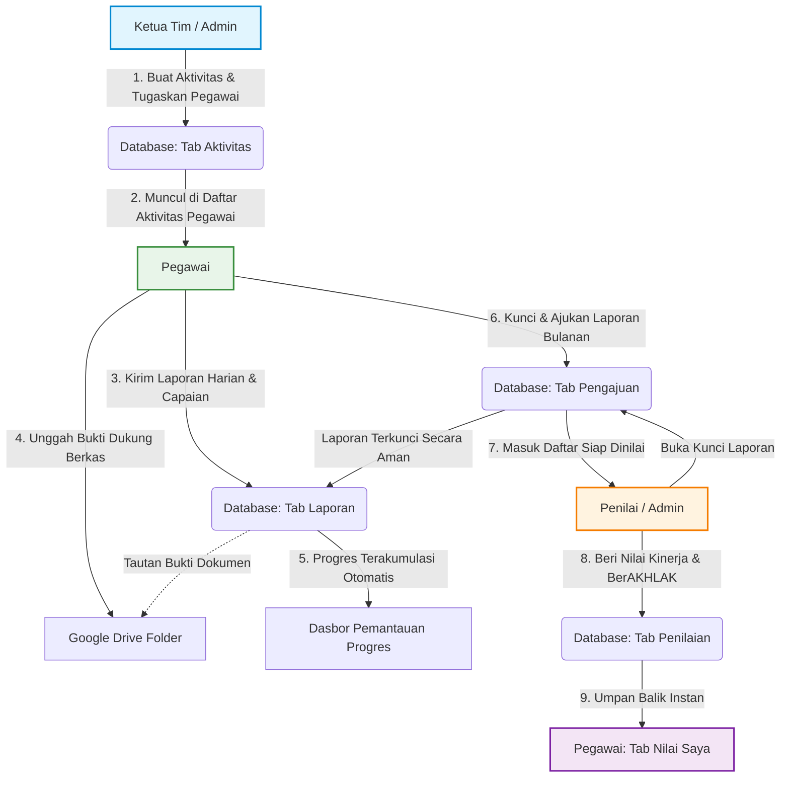

# 📘 Panduan Alur Kerja Aplikasi Manajemen Kinerja Tim
### BPS Kabupaten Puncak

Dokumen ini menjelaskan alur kerja dari perencanaan aktivitas, pelaporan harian oleh pegawai, penguncian bulanan, hingga penilaian bulanan (Kinerja & BerAKHLAK) oleh penilai.

---

## 👥 Hak Akses Berdasarkan Peran (Role)

Untuk memahami alur kerja, berikut adalah hak akses dari masing-masing peran di aplikasi:
*   **Admin**: Mengelola pengguna & peran, serta memiliki semua hak akses Ketua Tim & Penilai.
*   **Ketua Tim**: Membuat aktivitas program, menugaskan pegawai, dan memantau capaian progres tim.
*   **Penilai**: Melakukan penilaian bulanan (Kinerja & nilai BerAKHLAK ASN) untuk seluruh pegawai yang sudah mengajukan laporan.
*   **Pegawai**: Melihat aktivitas yang ditugaskan, mengirimkan laporan harian beserta bukti dukung, mengajukan kunci laporan bulanan, dan melihat rekap penilaian bulanan miliknya.
*   **Tamu**: Pengguna baru yang mendaftar secara mandiri dan sedang menunggu persetujuan Admin.

---

## 📊 Diagram Alur Kerja (Workflow Diagram)

---

## 🚶‍♂️ Langkah demi Langkah Alur Kerja

### 1. Tahap Perencanaan (Oleh: Ketua Tim / Admin)
Sebagai pemimpin tim, Ketua Tim menyusun rencana aktivitas kerja:
1.  Buka tab **Aktivitas**.
2.  Klik tombol **Tambah Aktivitas**.
3.  Tentukan hierarki program kerja:
    *   **Tujuan** -> **Sasaran** -> **IKU** -> **Kegiatan** -> **Sub Kegiatan** (opsi ini sudah terintegrasi dari referensi BPS).
4.  Masukkan rincian aktivitas:
    *   **Nama Aktivitas**: Judul tugas spesifik yang akan dikerjakan.
    *   **Target & Satuan**: Jumlah output yang ditargetkan (misal: `100` satuan `dokumen`).
    *   **Periode Mulai & Selesai**: Rentang waktu pengerjaan.
    *   **Ditugaskan Kepada**: Pilih satu atau lebih nama Pegawai yang bertanggung jawab atas tugas ini.
5.  Klik **Simpan**.

---

### 2. Tahap Pelaporan & Penguncian (Oleh: Pegawai)
Pegawai mengisi laporan harian dan mengunci datanya di akhir bulan:
1.  Buka tab **Lapor Harian**.
2.  Pilih bulan pengerjaan pada filter **Pilih Bulan Laporan** di bagian atas.
3.  Klik tombol **Buat Laporan Baru** (tombol ini hanya muncul jika bulan tersebut belum dikunci).
4.  Isi formulir laporan harian:
    *   **Tanggal**: Tanggal pengerjaan aktivitas.
    *   **Jumlah Capaian**: Berapa target yang berhasil diselesaikan pada hari itu.
    *   **Uraian Laporan**: Penjelasan singkat pekerjaan yang dilakukan.
    *   **File Bukti** atau **Link**: Pilih berkas pendukung untuk diunggah langsung ke Google Drive BPS atau masukkan tautan eksternal.
5.  Klik **Kirim Laporan**.
6.  **Kunci Laporan (Akhir Bulan)**: Jika semua laporan untuk bulan tersebut sudah selesai diinput, klik tombol **Kunci &amp; Ajukan Laporan**.
    *   Setelah dikunci, pegawai tidak dapat lagi menambah, mengedit, atau menghapus laporan untuk bulan tersebut demi menjaga integritas data penilaian.

---

### 3. Tahap Penilaian & Buka Kunci (Oleh: Penilai / Admin)
Di akhir bulan, Penilai melakukan evaluasi berdasarkan pengajuan laporan pegawai:
1.  Buka tab **Penilaian Bulanan**.
2.  Pilih **Pilih Periode Bulan** evaluasi.
3.  Periksa daftar pegawai pada kolom **Belum Dinilai**:
    *   🔴 **Belum Mengajukan**: Pegawai yang belum mengunci laporannya. Penilai tidak dapat memberi nilai (tombol *Beri Nilai* dinonaktifkan untuk menghindari penilaian data yang tidak lengkap).
    *   🟡 **Menunggu Penilaian**: Pegawai yang sudah mengunci laporannya. Tombol **Beri Nilai** akan aktif.
4.  Klik tombol **Beri Nilai** untuk memberikan rating Kinerja dan evaluasi Core Values BerAKHLAK ASN (skala 1-5).
5.  **Buka Kunci Laporan (Re-open/Rollback)**: Jika pegawai melakukan kesalahan input atau lupa melaporkan sesuatu setelah laporannya dikunci, Penilai atau Admin dapat mengeklik tombol **Buka Kunci (ikon gembok terbuka)** di sebelah nama pegawai. Laporan pegawai pada bulan tersebut akan terbuka kembali untuk diedit.

---

### 4. Tahap Umpan Balik (Oleh: Pegawai / Ketua Tim)
Setiap pegawai (termasuk Ketua Tim) dapat melihat hasil penilaian penilai secara transparan:
1.  Buka tab **Nilai Saya**.
2.  Pilih **Bulan** penilaian yang ingin dilihat.
3.  Pegawai dapat melihat:
    *   Skor Kinerja Bulanan.
    *   Grafik Radar/Rincian Nilai Karakter BerAKHLAK.
    *   Catatan evaluasi dan saran dari Penilai untuk perbaikan kualitas kerja di bulan berikutnya.
