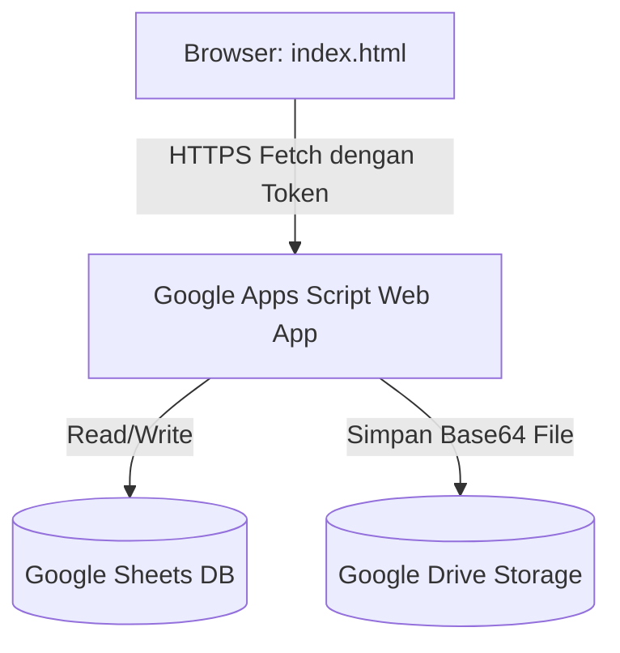

# Manajemen Kinerja Tim — BPS Kabupaten Puncak

Aplikasi manajemen rencana kinerja dan laporan aktivitas harian pegawai BPS Kabupaten Puncak. Aplikasi ini dirancang menggunakan arsitektur **Serverless Single Page Application (SPA)** yang memanfaatkan **Google Sheets** sebagai database relasional dan **Google Drive** sebagai penyimpanan berkas/bukti dukung.

---

## 🏗️ Arsitektur Sistem



- **Frontend**: [index.html](file:///home/ihza/Projects/rebahan/index.html) tunggal berisi UI responsif (HTML5, Vanilla CSS, dan Javascript) menggunakan font *Fraunces* & *Inter*, serta pustaka ikon *Lucide*.
- **Backend (API Proxy)**: Dihosting di Google Apps Script Web App ([index.html#L1094](file:///home/ihza/Projects/rebahan/index.html#L1094)).
- **Database**: Spreadsheet Google dengan tabel terpisah untuk `users`, `aktivitas`, dan `laporan`.

---

## ⚠️ Analisis Kebocoran & Celah Keamanan (Secrets & Credentials)

> [!WARNING]
> Aplikasi ini bersifat **Client-Side** tanpa server perantara pribadi. Karena itu, terdapat beberapa risiko keamanan yang harus diantisipasi:

1. **Eksposisi `APPS_SCRIPT_URL`**
   - **Lokasi**: [index.html#L1094](file:///home/ihza/Projects/rebahan/index.html#L1094)
   - **Risiko**: Siapa saja yang membuka kode sumber atau memantau lalu lintas jaringan browser dapat melihat URL Web App Google Apps Script Anda. Jika Apps Script tidak diamankan, pihak luar dapat memanipulasi database BPS.
2. **Celah Pendaftaran Pengguna Publik**
   - **Risiko**: Aksi `register` ([index.html#L1288](file:///home/ihza/Projects/rebahan/index.html#L1288)) mengirimkan request pembuatan akun ke Apps Script. Jika Apps Script tidak membatasi pembuatan akun baru (misalnya, hanya Ketua Tim terautentikasi yang boleh memanggil fungsi tambah anggota), maka siapapun dapat mendaftarkan diri secara ilegal.
3. **Keamanan Kata Sandi di Google Sheets**
   - **Risiko**: Jika Apps Script menyimpan password langsung sebagai plaintext di baris spreadsheet, maka siapa saja yang memiliki akses edit ke Google Sheets dapat melihat password semua pegawai.

---

## 🔒 Solusi Pengamanan Backend (Google Apps Script)

Untuk mengamankan database Google Sheets dan akun pegawai BPS Kabupaten Puncak dari kebocoran URL di atas, terapkan langkah-langkah keamanan berikut pada kode **Google Apps Script (Code.gs)** Anda:

### 1. Batasi Origin Akses (CORS & Referrer Checking)
Tambahkan validasi di bagian atas fungsi `doGet(e)` dan `doPost(e)` di Google Apps Script untuk memastikan request hanya berasal dari domain web resmi Anda (misalnya GitHub Pages):

```javascript
// Tambahkan di awal doGet(e) atau doPost(e) di Apps Script
var ALLOWED_ORIGIN = "https://ipds6104.github.io"; // Ganti dengan domain hosting Anda

function doPost(e) {
  // Validasi Origin/Referer sederhana
  // Catatan: Google Apps Script Web App kadang tidak mengirim Header Origin lengkap,
  // namun Anda bisa mengirimkan parameter 'origin' kustom dari fetch() di index.html untuk divalidasi.
}
```

### 2. Gunakan Hashing Sandi (Bukan Plaintext)
Jangan simpan password mentah di Google Sheet. Gunakan hash satu arah (SHA-256) saat menyimpan dan mencocokkan kata sandi:

```javascript
// Fungsi Hash di Google Apps Script
function hashPassword(password) {
  var rawHash = Utilities.computeDigest(Utilities.DigestAlgorithm.SHA_256, password, Utilities.Charset.UTF_8);
  var output = "";
  for (var i = 0; i < rawHash.length; i++) {
    var v = rawHash[i] & 0xff;
    if (v < 16) {
      output += "0";
    }
    output += v.toString(16);
  }
  return output; // Simpan string hash ini ke Google Sheet
}
```

### 3. Validasi Hak Akses (Otorisasi Sisi Server)
Setiap kali fungsi penulisan/penghapusan data dipanggil di Apps Script (seperti `createAktivitas`, `deleteAktivitas`), lakukan verifikasi token session di Apps Script:
- Pastikan token dikirim dan cocok dengan token aktif di tabel `sessions` atau `users`.
- Pastikan peran (*role*) user adalah `ketua_tim` sebelum mengeksekusi operasi administratif.

---

## 🚀 Panduan Setup & Jalankan Lokal

### 1. Menjalankan Aplikasi Secara Lokal
Karena aplikasi ini hanya menggunakan satu berkas HTML statis, Anda dapat menjalankannya langsung di browser Anda:
- Cukup buka file [index.html](file:///home/ihza/Projects/rebahan/index.html) menggunakan browser Anda (Double-click atau drag & drop file).
- Atau gunakan ekstensi VS Code seperti **Live Server** untuk menjalankannya pada alamat lokal (misal: `http://127.0.0.1:5500`).

### 2. Mengabaikan File Rahasia Lokal
File [.gitignore](file:///home/ihza/Projects/rebahan/.gitignore) telah dikonfigurasi untuk mencegah file lokal yang berisi dokumentasi sensitif terunggah secara tidak sengaja:

```text
# Mengabaikan file rahasia lokal
*.env
*secret*
*credential*
credentials.json
```
