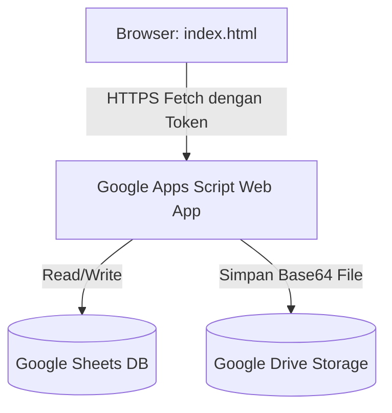

# Manajemen Kinerja Tim — BPS Kabupaten Puncak

Aplikasi manajemen rencana kinerja dan laporan aktivitas harian pegawai BPS Kabupaten Puncak. Aplikasi ini dirancang menggunakan arsitektur **Serverless Single Page Application (SPA)** yang memanfaatkan **Google Sheets** sebagai database relasional dan **Google Drive** sebagai penyimpanan berkas/bukti dukung.

## 🔗 Tautan Sumber Daya
- **Google Sheets (Database)**: [Buka Google Sheets Kinerja](https://docs.google.com/spreadsheets/d/189__cVOn0ZebNsdwxvzeqS_b1p9D2L_Ck7hR5sincc0/edit?gid=1291082304#gid=1291082304)
- **Google Drive (Penyimpanan Bukti Dukung)**: [Buka Folder Google Drive](https://drive.google.com/drive/folders/1tZ5vZgXWsut0nVaNcf92_7LAdHi3WxK5?hl=ID)

---

## 🏗️ Arsitektur Sistem



- **Frontend**: [index.html](file:///home/ihza/Projects/rebahan/index.html) tunggal berisi UI responsif (HTML5, Vanilla CSS, dan Javascript).
- **Backend (API Proxy)**: Dihosting di Google Apps Script Web App ([index.html#L1094](file:///home/ihza/Projects/rebahan/index.html#L1094)).
- **Database**: Spreadsheet Google dengan 5 tab: `users`, `referensi`, `aktivitas`, `laporan`, dan `penilaian`.

---

## 📊 Struktur Database Google Sheets (Tab & Kolom)

Spreadsheet Google Anda **harus memiliki 5 tab** dengan nama dan susunan kolom (header baris pertama) seperti berikut:

### 1. Tab `users`
Mencatat akun pengguna. Admin utama harus dimasukkan secara manual langsung di dalam Google Sheets.
- **Nama Tab**: `users`
- **Kolom**: `id`, `nama`, `role`, `password`, `token`
- **Role yang Valid**:
  - `admin`: Memiliki hak penuh mengubah peran pengguna di UI. (Harus diisi manual pertama kali di Sheet).
  - `ketua_tim`: Menyusun rencana kerja, menetapkan aktivitas, dan memantau tim.
  - `penilai`: Melakukan penilaian bulanan kinerja & karakter BerAKHLAK pegawai.
  - `pegawai`: Melaporkan realisasi aktivitas harian.
  - `tamu`: Peran bawaan saat pendaftaran mandiri (menunggu persetujuan admin).

---

### 2. Tab `referensi`
Menampung struktur pohon program kerja dari Tujuan tingkat atas hingga Sub Kegiatan tingkat bawah.
- **Nama Tab**: `referensi`
- **Kolom**: `tujuan`, `sasaran`, `iku`, `kegiatan`, `subKegiatan`

---

### 3. Tab `aktivitas`
Menyimpan daftar rencana aktivitas kerja spesifik beserta target dan penugasan pegawai (PIC).
- **Nama Tab**: `aktivitas`
- **Kolom**: `id`, `tujuan`, `sasaran`, `iku`, `kegiatan`, `subKegiatan`, `nama`, `target`, `satuan`, `assignedTo`, `periodeMulai`, `periodeSelesai`

---

### 4. Tab `laporan`
Menampung realisasi harian/bukti kerja yang dilaporkan pegawai.
- **Nama Tab**: `laporan`
- **Kolom**: `id`, `aktivitasId`, `pegawaiId`, `tanggal`, `capaian`, `uraian`, `buktiTipe`, `buktiNama`, `buktiUrl`, `createdAt`

---

### 5. Tab `penilaian`
Menyimpan data penilaian kinerja bulanan dan nilai karakter BerAKHLAK per pegawai.
- **Nama Tab**: `penilaian`
- **Kolom**:
  - `id` (ID unik penilaian)
  - `pegawaiId` (ID pegawai yang dinilai)
  - `penilaiId` (ID penilai)
  - `bulan` (Format `YYYY-MM`, contoh: `2026-07`)
  - `nilaiKinerja` (Teks: `Tidak baik`, `Cukup baik`, `Baik`, `Sangat baik`)
  - `berorientasiPelayanan` (Angka/Skala `1` s.d `5`)
  - `akuntabel` (Angka/Skala `1` s.d `5`)
  - `kompeten` (Angka/Skala `1` s.d `5`)
  - `harmonis` (Angka/Skala `1` s.d `5`)
  - `loyal` (Angka/Skala `1` s.d `5`)
  - `adaptif` (Angka/Skala `1` s.d `5`)
  - `kolaboratif` (Angka/Skala `1` s.d `5`)
  - `catatan` (Teks masukan evaluasi)
  - `createdAt` (Timestamp waktu penilaian)

---

## 🔒 Kode Google Apps Script (`Code.js`)

Seluruh logika backend Google Apps Script telah dipisahkan ke dalam berkas khusus: [Code.js](file:///home/ihza/Projects/rebahan/Code.js).

### Cara Menggunakan:
1. Buka Google Sheets Anda, lalu klik menu **Extensions > Apps Script**.
2. Salin seluruh isi kode dari berkas [Code.js](file:///home/ihza/Projects/rebahan/Code.js) di repositori ini, lalu tempel (*paste*) ke dalam editor Google Apps Script.
3. Pastikan Anda telah memasukkan ID Folder Google Drive Anda pada variabel `DRIVE_FOLDER_ID` di baris atas script.
4. Klik tombol **Deploy > New Deployment**, pilih tipe **Web App**, jalankan sebagai **Me (email Anda)**, dan atur hak akses ke **Anyone**.


---

## 🚀 Panduan Setup & Jalankan Lokal

### 1. Menjalankan Aplikasi Secara Lokal
Karena aplikasi ini hanya menggunakan satu berkas HTML statis, Anda dapat menjalankannya langsung di browser Anda:
- Cukup buka file [index.html](file:///home/ihza/Projects/rebahan/index.html) menggunakan browser Anda (Double-click atau drag & drop file).
- Atau gunakan ekstensi VS Code seperti **Live Server** untuk menjalankannya pada alamat lokal (misal: `http://127.0.0.1:5500`).

### 2. Mengabaikan File Rahasia Lokal
File [.gitignore](file:///home/ihza/Projects/rebahan/.gitignore) telah dikonfigurasi untuk mencegah file lokal yang berisi dokumentasi sensitif terunggah secara tidak sengaja:

```text
# Mengabaikan file rahasia lokal
*.env
*secret*
*credential*
credentials.json
```
