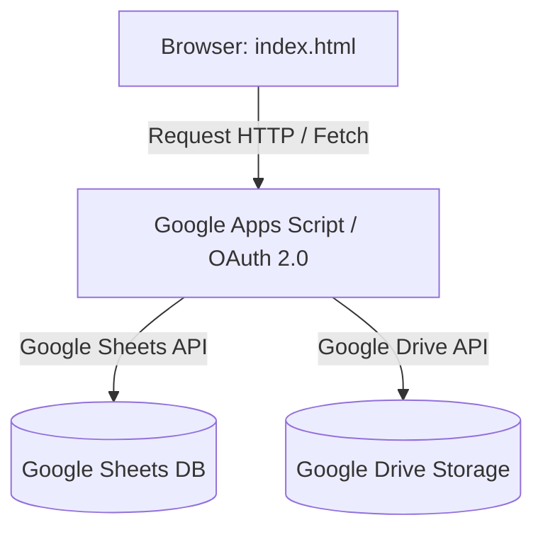

# Rebahan App (Single-File Web App)

Aplikasi web sederhana berbasis satu halaman (`index.html`) yang dirancang untuk berjalan tanpa server backend tradisional (*serverless/static hosting*). Aplikasi ini menggunakan **Google Sheets** sebagai database data terstruktur dan **Google Drive** untuk penyimpanan berkas/media.

---

## 🏗️ Arsitektur Aplikasi



- **Frontend**: Single `index.html` dengan Javascript Vanilla (atau framework ringan yang di-compile ke HTML tunggal). Bisa di-host gratis di GitHub Pages, Vercel, Netlify, atau Cloudflare Pages.
- **Database (Data Terstruktur)**: Google Sheets.
- **Penyimpanan Berkas (Media/Dokumen)**: Google Drive.

---

## ⚠️ Analisis Risiko Keamanan & Kebocoran Kredensial (Secrets)

> [!WARNING]
> Karena aplikasi ini bertipe **Client-Side (SPA/Single HTML)** tanpa server backend penengah, kode sumber (HTML & JavaScript) dapat dibaca langsung oleh siapa saja melalui fitur *View Source* atau *Inspect Element* di browser. 

Berikut adalah potensi celah kebocoran kredensial jika aplikasi mengakses API Google secara langsung dari browser:

1. **Kebocoran File Kunci Service Account (`.json`)**
   - **Bahaya**: Mengunggah file `.json` Service Account ke repositori publik atau memuatnya langsung di JavaScript klien adalah **sangat berbahaya**. Siapa pun dapat mengekstrak kunci privat tersebut dan mengontrol seluruh resource Google Cloud Anda.
2. **Kebocoran Google API Key**
   - **Bahaya**: Kunci API (*API Key*) yang ditulis mentah (*hardcoded*) di JavaScript dapat dicuri untuk mengonsumsi kuota API project Google Cloud Anda, atau bahkan mengakses layanan Google Cloud lain yang diaktifkan pada project yang sama.
3. **Kebocoran OAuth 2.0 Client Secret**
   - **Bahaya**: Menggunakan *Client Secret* di frontend melanggar protokol OAuth 2.0. Client Secret hanya boleh disimpan di server aman.

---

## 🔒 Solusi & Mitigasi Penanganan Kebocoran Kredensial

Untuk menjaga aplikasi tetap berjalan sebagai *Single HTML* namun tetap aman dari kebocoran kredensial, gunakan salah satu dari tiga solusi di bawah ini:

### Opsi 1: Google Apps Script (GAS) Web App sebagai API Proxy (Sangat Direkomendasikan)
Alih-alih memanggil Google Sheets API langsung dari browser dengan API Key/Service Account, buatlah **Google Apps Script** yang bertindak sebagai jembatan/API proxy.

- **Cara Kerja**:
  1. Anda menulis skrip sederhana di Google Apps Script (terikat pada Google Sheet target).
  2. Publikasikan skrip sebagai **Web App** dengan opsi:
     - *Execute as*: **Me** (akun Anda yang memiliki akses sheet).
     - *Who has access*: **Anyone** (atau dibatasi token otorisasi kustom).
  3. Aplikasi `index.html` Anda hanya perlu melakukan `fetch()` ke URL Web App Apps Script tersebut (misal: `https://script.google.com/macros/s/.../exec`).
- **Keuntungan**: Kredensial Google Cloud, ID Sheet, dan hak akses database tersembunyi dengan aman di server Google Apps Script. Klien tidak pernah tahu detail kredensialnya.

### Opsi 2: Menggunakan OAuth 2.0 User-Agent Flow (Client-Side)
Jika aplikasi membutuhkan pengguna untuk masuk menggunakan akun Google mereka sendiri untuk membaca/menulis data pribadi mereka.

- **Cara Kerja**:
  - Gunakan alur **OAuth 2.0 Implicit Grant** atau **Authorization Code Flow dengan PKCE**.
  - Aplikasi hanya mengekspos **Client ID** (ini aman dipublikasikan secara publik).
  - Browser akan mengalihkan pengguna ke halaman login Google resmi, dan Google akan mengembalikan *Access Token* jangka pendek ke browser.
- **Keuntungan**: Tidak ada *Client Secret* yang disimpan di kode sumber.

### Opsi 3: Membatasi Google API Key (Jika Terpaksa Menggunakan API Key Langsung)
Jika Anda terpaksa menggunakan API Key di frontend untuk membaca Google Sheet yang diset "Public (Anyone with link can view)".

- **Langkah Pengamanan**:
  1. Masuk ke **Google Cloud Console** > **APIs & Services** > **Credentials**.
  2. Edit API Key yang digunakan dan tambahkan **Application Restrictions**:
     - Atur ke **HTTP Referrers (Websites)**.
     - Daftarkan hanya URL domain hosting tempat `index.html` berada (misal: `https://ipds6104.github.io/*`).
  3. Tambahkan **API Restrictions**:
     - Batasi agar API Key tersebut **hanya** bisa mengakses *Google Sheets API* dan *Google Drive API*.

---

## 🚀 Panduan Setup & Struktur Repositori

### 1. Struktur Folder
```text
.
├── index.html        # Aplikasi utama (Single HTML/CSS/JS)
├── README.md         # Dokumentasi (File ini)
└── .gitignore        # Mengabaikan file sensitif lokal jika ada
```

### 2. Mengamankan Berkas Lokal dengan `.gitignore`
Pastikan Anda membuat file `.gitignore` untuk mencegah file pengujian lokal yang berisi kredensial tidak sengaja terunggah ke repositori GitHub publik:

```text
# .gitignore
# Mengabaikan berkas config atau catatan berisi kunci rahasia lokal
*.env
*secret*
*credential*
.vscode/
node_modules/
```

### 3. Contoh Implementasi Google Apps Script (Opsi 1)
Berikut adalah contoh skrip sederhana yang dapat Anda tempel di Google Sheets Anda (`Extensions` > `Apps Script`) untuk menerima data dari `index.html`:

```javascript
// Google Apps Script (Code.gs)
function doPost(e) {
  var sheet = SpreadsheetApp.getActiveSpreadsheet().getActiveSheet();
  try {
    var data = JSON.parse(e.postData.contents);
    
    // Tambahkan baris baru ke Sheet
    sheet.appendRow([
      new Date(), // Timestamp
      data.nama,
      data.keterangan,
      data.url_drive
    ]);
    
    return ContentService.createTextOutput(JSON.stringify({
      "status": "success",
      "message": "Data berhasil disimpan!"
    })).setMimeType(ContentService.MimeType.JSON);
    
  } catch(error) {
    return ContentService.createTextOutput(JSON.stringify({
      "status": "error",
      "message": error.toString()
    })).setMimeType(ContentService.MimeType.JSON);
  }
}
```
Panggil endpoint Apps Script di atas dari [index.html](file:///home/ihza/Projects/rebahan/index.html) menggunakan metode `POST`.
