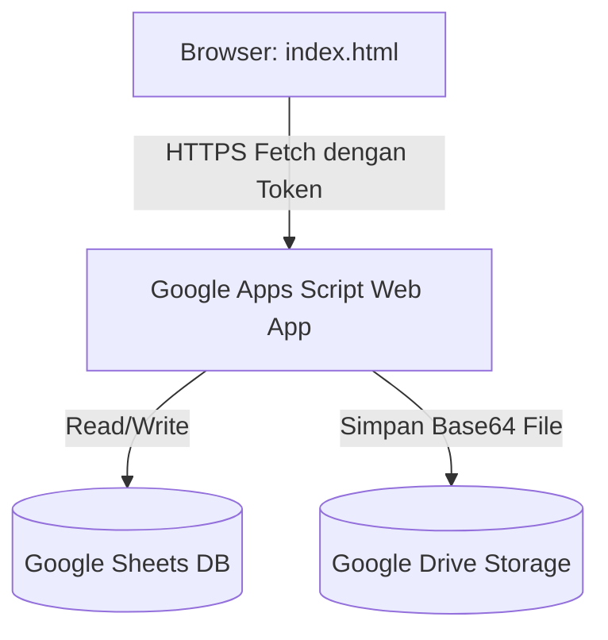

# Manajemen Kinerja Tim — BPS Kabupaten Puncak

Aplikasi manajemen rencana kinerja dan laporan aktivitas harian pegawai BPS Kabupaten Puncak. Aplikasi ini dirancang menggunakan arsitektur **Serverless Single Page Application (SPA)** yang memanfaatkan **Google Sheets** sebagai database relasional dan **Google Drive** sebagai penyimpanan berkas/bukti dukung.

## 🔗 Tautan Sumber Daya
- **Google Sheets (Database)**: [Buka Google Sheets Kinerja](https://docs.google.com/spreadsheets/d/189__cVOn0ZebNsdwxvzeqS_b1p9D2L_Ck7hR5sincc0/edit?gid=1291082304#gid=1291082304)
- **Google Drive (Penyimpanan Bukti Dukung)**: [Buka Folder Google Drive](https://drive.google.com/drive/u/3/folders/1R3IMVaNRJePMidiffq6iJco6sKcEGA9M)

---

## 🏗️ Arsitektur Sistem



- **Frontend**: [index.html](file:///home/ihza/Projects/rebahan/index.html) tunggal berisi UI responsif (HTML5, Vanilla CSS, dan Javascript).
- **Backend (API Proxy)**: Dihosting di Google Apps Script Web App ([index.html#L1094](file:///home/ihza/Projects/rebahan/index.html#L1094)).
- **Database**: Spreadsheet Google dengan 5 tab: `users`, `referensi`, `aktivitas`, `laporan`, dan `penilaian`.

---

## 📊 Struktur Database Google Sheets (Tab & Kolom)

Spreadsheet Google Anda **harus memiliki 5 tab** dengan nama dan susunan kolom (header baris pertama) seperti berikut:

### 1. Tab `users`
Mencatat akun pengguna. Admin utama harus dimasukkan secara manual langsung di dalam Google Sheets.
- **Nama Tab**: `users`
- **Kolom**: `id`, `nama`, `role`, `password`, `token`
- **Role yang Valid**:
  - `admin`: Memiliki hak penuh mengubah peran pengguna di UI. (Harus diisi manual pertama kali di Sheet).
  - `ketua_tim`: Menyusun rencana kerja, menetapkan aktivitas, dan memantau tim.
  - `penilai`: Melakukan penilaian bulanan kinerja & karakter BerAKHLAK pegawai.
  - `pegawai`: Melaporkan realisasi aktivitas harian.
  - `tamu`: Peran bawaan saat pendaftaran mandiri (menunggu persetujuan admin).

---

### 2. Tab `referensi`
Menampung struktur pohon program kerja dari Tujuan tingkat atas hingga Sub Kegiatan tingkat bawah.
- **Nama Tab**: `referensi`
- **Kolom**: `tujuan`, `sasaran`, `iku`, `kegiatan`, `subKegiatan`

---

### 3. Tab `aktivitas`
Menyimpan daftar rencana aktivitas kerja spesifik beserta target dan penugasan pegawai (PIC).
- **Nama Tab**: `aktivitas`
- **Kolom**: `id`, `tujuan`, `sasaran`, `iku`, `kegiatan`, `subKegiatan`, `nama`, `target`, `satuan`, `assignedTo`, `periodeMulai`, `periodeSelesai`

---

### 4. Tab `laporan`
Menampung realisasi harian/bukti kerja yang dilaporkan pegawai.
- **Nama Tab**: `laporan`
- **Kolom**: `id`, `aktivitasId`, `pegawaiId`, `tanggal`, `capaian`, `uraian`, `buktiTipe`, `buktiNama`, `buktiUrl`, `createdAt`

---

### 5. Tab `penilaian`
Menyimpan data penilaian kinerja bulanan dan nilai karakter BerAKHLAK per pegawai.
- **Nama Tab**: `penilaian`
- **Kolom**:
  - `id` (ID unik penilaian)
  - `pegawaiId` (ID pegawai yang dinilai)
  - `penilaiId` (ID penilai)
  - `bulan` (Format `YYYY-MM`, contoh: `2026-07`)
  - `nilaiKinerja` (Teks: `Tidak baik`, `Cukup baik`, `Baik`, `Sangat baik`)
  - `berorientasiPelayanan` (Angka/Skala `1` s.d `5`)
  - `akuntabel` (Angka/Skala `1` s.d `5`)
  - `kompeten` (Angka/Skala `1` s.d `5`)
  - `harmonis` (Angka/Skala `1` s.d `5`)
  - `loyal` (Angka/Skala `1` s.d `5`)
  - `adaptif` (Angka/Skala `1` s.d `5`)
  - `kolaboratif` (Angka/Skala `1` s.d `5`)
  - `catatan` (Teks masukan evaluasi)
  - `createdAt` (Timestamp waktu penilaian)

---

## 🔒 Kode Google Apps Script (`Code.gs`) Lengkap

Tempelkan kode berikut ke bagian **Extensions > Apps Script** di Google Sheets Anda. Setelah ditempel, klik **Deploy > New Deployment**, pilih tipe **Web App**, jalankan sebagai **Me**, dan atur hak akses ke **Anyone**.

```javascript
// Konfigurasi ID Folder Google Drive untuk menampung berkas unggahan bukti dukung
var DRIVE_FOLDER_ID = "TEMPEL_ID_FOLDER_DRIVE_ANDA_DI_SINI"; 

function doGet(e) {
  var action = e.parameter.action;
  var token = e.parameter.token;
  
  // Validasi login & pendaftaran tidak memerlukan token
  if (action === "status") {
    return jsonResponse({ hasUsers: getSheetRows("users").length > 0 });
  }
  
  // Verifikasi Pengguna
  var activeUser = getUserByToken(token);
  if (!activeUser && action !== "referensi") {
    return jsonResponse({ error: "Sesi kedaluwarsa atau tidak valid. Silakan login kembali." });
  }

  try {
    switch (action) {
      case "me":
        return jsonResponse(activeUser);
      case "users":
        // Hanya admin, ketua tim, dan penilai yang boleh melihat list seluruh user
        if (["admin", "ketua_tim", "penilai"].indexOf(activeUser.role) === -1) {
          return jsonResponse({ error: "Akses ditolak." });
        }
        var users = getSheetRows("users").map(function(u) {
          return { id: u.id, nama: u.nama, role: u.role };
        });
        return jsonResponse(users);
      case "referensi":
        return jsonResponse(buildReferensiHierarchy());
      case "aktivitas":
        var rawAktivitas = getSheetRows("aktivitas");
        var listAktivitas = rawAktivitas.map(function(a) {
          var assigned = [];
          try { assigned = JSON.parse(a.assignedTo || "[]"); } catch(e) { 
            if(a.assignedTo) assigned = a.assignedTo.split(",");
          }
          return {
            id: a.id, tujuan: a.tujuan, sasaran: a.sasaran, iku: a.iku,
            kegiatan: a.kegiatan, subKegiatan: a.subKegiatan, nama: a.nama,
            target: Number(a.target) || 0, satuan: a.satuan, assignedTo: assigned,
            periodeMulai: a.periodeMulai, periodeSelesai: a.periodeSelesai
          };
        });
        return jsonResponse(listAktivitas);
      case "laporan":
        var rawLaporan = getSheetRows("laporan");
        var listLaporan = rawLaporan.map(function(l) {
          return {
            id: l.id, aktivitasId: l.aktivitasId, pegawaiId: l.pegawaiId,
            tanggal: l.tanggal, capaian: Number(l.capaian) || 0, uraian: l.uraian,
            buktiTipe: l.buktiTipe, buktiNama: l.buktiNama, buktiUrl: l.buktiUrl,
            createdAt: Number(l.createdAt) || 0
          };
        });
        return jsonResponse(listLaporan);
      case "penilaian":
        var rawPenilaian = getSheetRows("penilaian");
        var listPenilaian = rawPenilaian.map(function(p) {
          return {
            id: p.id, pegawaiId: p.pegawaiId, penilaiId: p.penilaiId, bulan: p.bulan,
            nilaiKinerja: p.nilaiKinerja,
            berorientasiPelayanan: Number(p.berorientasiPelayanan) || 0,
            akuntabel: Number(p.akuntabel) || 0,
            kompeten: Number(p.kompeten) || 0,
            harmonis: Number(p.harmonis) || 0,
            loyal: Number(p.loyal) || 0,
            adaptif: Number(p.adaptif) || 0,
            kolaboratif: Number(p.kolaboratif) || 0,
            catatan: p.catatan, createdAt: Number(p.createdAt) || 0
          };
        });
        return jsonResponse(listPenilaian);
      default:
        return jsonResponse({ error: "Aksi GET tidak dikenal." });
    }
  } catch (error) {
    return jsonResponse({ error: error.toString() });
  }
}

function doPost(e) {
  try {
    var data = JSON.parse(e.postData.contents);
    var action = data.action;
    var token = data.token;
    
    // Login & Register Mandiri
    if (action === "login") {
      return handleLogin(data.nama, data.password);
    }
    if (action === "register") {
      return handleRegister(data.nama, data.password);
    }
    
    var activeUser = getUserByToken(token);
    if (!activeUser) {
      return jsonResponse({ error: "Sesi tidak valid." });
    }
    
    switch (action) {
      case "updateUser":
        // Hanya admin yang bisa mengupdate peran (role)
        if (activeUser.role !== "admin") {
          return jsonResponse({ error: "Hanya Admin yang dapat mengelola peran pengguna." });
        }
        return handleUpdateUser(data);
      case "deleteUser":
        if (activeUser.role !== "admin") return jsonResponse({ error: "Akses ditolak." });
        return handleDeleteRow("users", data.id);
        
      case "createAktivitas":
        if (["admin", "ketua_tim"].indexOf(activeUser.role) === -1) return jsonResponse({ error: "Akses ditolak." });
        return handleCreateAktivitas(data);
      case "updateAktivitas":
        if (["admin", "ketua_tim"].indexOf(activeUser.role) === -1) return jsonResponse({ error: "Akses ditolak." });
        return handleUpdateAktivitas(data);
      case "deleteAktivitas":
        if (["admin", "ketua_tim"].indexOf(activeUser.role) === -1) return jsonResponse({ error: "Akses ditolak." });
        return handleDeleteRow("aktivitas", data.id);
        
      case "createLaporan":
        return handleCreateLaporan(activeUser.id, data);
      case "updateLaporan":
        return handleUpdateLaporan(activeUser.id, data);
      case "deleteLaporan":
        return handleDeleteLaporan(activeUser.id, data.id);
        
      case "createPenilaian":
        if (["admin", "penilai"].indexOf(activeUser.role) === -1) return jsonResponse({ error: "Akses ditolak." });
        return handleCreatePenilaian(activeUser.id, data);
      case "updatePenilaian":
        if (["admin", "penilai"].indexOf(activeUser.role) === -1) return jsonResponse({ error: "Akses ditolak." });
        return handleUpdatePenilaian(activeUser.id, data);
      case "deletePenilaian":
        if (["admin", "penilai"].indexOf(activeUser.role) === -1) return jsonResponse({ error: "Akses ditolak." });
        return handleDeleteRow("penilaian", data.id);
        
      case "logout":
        return handleLogout(token);
      default:
        return jsonResponse({ error: "Aksi POST tidak dikenal." });
    }
  } catch (error) {
    return jsonResponse({ error: error.toString() });
  }
}

// ======================== CORE OPERATIONS ========================

function handleLogin(nama, password) {
  var rows = getSheetRows("users");
  var hashedPassword = hashPassword(password);
  for (var i = 0; i < rows.length; i++) {
    if (rows[i].nama.toLowerCase() === nama.toLowerCase()) {
      // Periksa kecocokan sandi
      if (rows[i].password !== hashedPassword && rows[i].password !== password) {
        return jsonResponse({ error: "Kata sandi salah." });
      }
      var token = Utilities.getUuid();
      updateRowField("users", rows[i].id, "token", token);
      return jsonResponse({
        user: { id: rows[i].id, nama: rows[i].nama, role: rows[i].role },
        token: token
      });
    }
  }
  return jsonResponse({ error: "Pengguna tidak ditemukan." });
}

function handleRegister(nama, password) {
  var rows = getSheetRows("users");
  for (var i = 0; i < rows.length; i++) {
    if (rows[i].nama.toLowerCase() === nama.toLowerCase()) {
      return jsonResponse({ error: "Nama sudah terdaftar." });
    }
  }
  
  var isFirstUser = rows.length === 0;
  // User pertama kali register akan menjadi admin untuk bootstrap, selanjutnya otomatis menjadi tamu (guest)
  var role = isFirstUser ? "admin" : "tamu";
  
  var newUser = {
    id: "usr_" + Date.now(),
    nama: nama,
    role: role,
    password: hashPassword(password),
    token: ""
  };
  
  appendSheetRow("users", newUser);
  return jsonResponse({ 
    success: true, 
    message: isFirstUser ? "Pendaftaran Admin berhasil." : "Pendaftaran berhasil. Silakan hubungi Administrator untuk persetujuan akun Anda." 
  });
}

function handleUpdateUser(data) {
  var sheet = getSheet("users");
  var rows = getSheetRows("users");
  for (var i = 0; i < rows.length; i++) {
    if (rows[i].id === data.id) {
      var rowNum = i + 2;
      if (data.nama) sheet.getRange(rowNum, 2).setValue(data.nama);
      if (data.role) sheet.getRange(rowNum, 3).setValue(data.role);
      if (data.password) sheet.getRange(rowNum, 4).setValue(hashPassword(data.password));
      return jsonResponse({ success: true });
    }
  }
  return jsonResponse({ error: "User tidak ditemukan." });
}

function handleCreateAktivitas(data) {
  var newAkt = {
    id: "akt_" + Date.now(),
    tujuan: data.tujuan,
    sasaran: data.sasaran,
    iku: data.iku,
    kegiatan: data.kegiatan,
    subKegiatan: data.subKegiatan,
    nama: data.nama,
    target: data.target,
    satuan: data.satuan,
    assignedTo: JSON.stringify(data.assignedTo || []),
    periodeMulai: data.periodeMulai,
    periodeSelesai: data.periodeSelesai
  };
  appendSheetRow("aktivitas", newAkt);
  return jsonResponse({ success: true });
}

function handleUpdateAktivitas(data) {
  var sheet = getSheet("aktivitas");
  var rows = getSheetRows("aktivitas");
  for (var i = 0; i < rows.length; i++) {
    if (rows[i].id === data.id) {
      var r = i + 2;
      sheet.getRange(r, 2).setValue(data.tujuan);
      sheet.getRange(r, 3).setValue(data.sasaran);
      sheet.getRange(r, 4).setValue(data.iku);
      sheet.getRange(r, 5).setValue(data.kegiatan);
      sheet.getRange(r, 6).setValue(data.subKegiatan);
      sheet.getRange(r, 7).setValue(data.nama);
      sheet.getRange(r, 8).setValue(data.target);
      sheet.getRange(r, 9).setValue(data.satuan);
      sheet.getRange(r, 10).setValue(JSON.stringify(data.assignedTo || []));
      sheet.getRange(r, 11).setValue(data.periodeMulai);
      sheet.getRange(r, 12).setValue(data.periodeSelesai);
      return jsonResponse({ success: true });
    }
  }
  return jsonResponse({ error: "Aktivitas tidak ditemukan." });
}

function handleCreateLaporan(pegawaiId, data) {
  var fileUrl = "";
  if (data.buktiTipe === "file" && data.buktiFileBase64) {
    fileUrl = uploadBase64File(data.buktiFileName, data.buktiFileMime, data.buktiFileBase64);
  } else if (data.buktiTipe === "link") {
    fileUrl = data.buktiLink;
  }
  
  var newLap = {
    id: "lap_" + Date.now(),
    aktivitasId: data.aktivitasId,
    pegawaiId: pegawaiId,
    tanggal: data.tanggal,
    capaian: data.capaian,
    uraian: data.uraian,
    buktiTipe: data.buktiTipe,
    buktiNama: data.buktiTipe === "file" ? data.buktiFileName : "",
    buktiUrl: fileUrl,
    createdAt: Date.now()
  };
  appendSheetRow("laporan", newLap);
  return jsonResponse({ success: true });
}

function handleUpdateLaporan(pegawaiId, data) {
  var sheet = getSheet("laporan");
  var rows = getSheetRows("laporan");
  for (var i = 0; i < rows.length; i++) {
    if (rows[i].id === data.id) {
      if (rows[i].pegawaiId !== pegawaiId) return jsonResponse({ error: "Akses ditolak." });
      
      var r = i + 2;
      var fileUrl = rows[i].buktiUrl;
      if (data.buktiTipe === "file" && data.buktiFileBase64) {
        fileUrl = uploadBase64File(data.buktiFileName, data.buktiFileMime, data.buktiFileBase64);
      } else if (data.buktiTipe === "link") {
        fileUrl = data.buktiLink;
      }
      
      sheet.getRange(r, 2).setValue(data.aktivitasId);
      sheet.getRange(r, 4).setValue(data.tanggal);
      sheet.getRange(r, 5).setValue(data.capaian);
      sheet.getRange(r, 6).setValue(data.uraian);
      sheet.getRange(r, 7).setValue(data.buktiTipe);
      sheet.getRange(r, 8).setValue(data.buktiTipe === "file" ? (data.buktiFileName || rows[i].buktiNama) : "");
      sheet.getRange(r, 9).setValue(fileUrl);
      return jsonResponse({ success: true });
    }
  }
  return jsonResponse({ error: "Laporan tidak ditemukan." });
}

function handleDeleteLaporan(pegawaiId, id) {
  var rows = getSheetRows("laporan");
  for (var i = 0; i < rows.length; i++) {
    if (rows[i].id === id) {
      if (rows[i].pegawaiId !== pegawaiId) return jsonResponse({ error: "Akses ditolak." });
      var sheet = getSheet("laporan");
      sheet.deleteRow(i + 2);
      return jsonResponse({ success: true });
    }
  }
  return jsonResponse({ error: "Laporan tidak ditemukan." });
}

function handleCreatePenilaian(penilaiId, data) {
  var newPen = {
    id: "pen_" + Date.now(),
    pegawaiId: data.pegawaiId,
    penilaiId: penilaiId,
    bulan: data.bulan,
    nilaiKinerja: data.nilaiKinerja,
    berorientasiPelayanan: data.berorientasiPelayanan,
    akuntabel: data.akuntabel,
    kompeten: data.kompeten,
    harmonis: data.harmonis,
    loyal: data.loyal,
    adaptif: data.adaptif,
    kolaboratif: data.kolaboratif,
    catatan: data.catatan || "",
    createdAt: Date.now()
  };
  appendSheetRow("penilaian", newPen);
  return jsonResponse({ success: true });
}

function handleUpdatePenilaian(penilaiId, data) {
  var sheet = getSheet("penilaian");
  var rows = getSheetRows("penilaian");
  for (var i = 0; i < rows.length; i++) {
    if (rows[i].id === data.id) {
      var r = i + 2;
      sheet.getRange(r, 2).setValue(data.pegawaiId);
      sheet.getRange(r, 3).setValue(penilaiId);
      sheet.getRange(r, 4).setValue(data.bulan);
      sheet.getRange(r, 5).setValue(data.nilaiKinerja);
      sheet.getRange(r, 6).setValue(data.berorientasiPelayanan);
      sheet.getRange(r, 7).setValue(data.akuntabel);
      sheet.getRange(r, 8).setValue(data.kompeten);
      sheet.getRange(r, 9).setValue(data.harmonis);
      sheet.getRange(r, 10).setValue(data.loyal);
      sheet.getRange(r, 11).setValue(data.adaptif);
      sheet.getRange(r, 12).setValue(data.kolaboratif);
      sheet.getRange(r, 13).setValue(data.catatan || "");
      return jsonResponse({ success: true });
    }
  }
  return jsonResponse({ error: "Penilaian tidak ditemukan." });
}

function handleLogout(token) {
  var sheet = getSheet("users");
  var rows = getSheetRows("users");
  for (var i = 0; i < rows.length; i++) {
    if (rows[i].token === token) {
      sheet.getRange(i + 2, 5).setValue(""); // Hapus token
      return jsonResponse({ success: true });
    }
  }
  return jsonResponse({ success: false });
}

// ======================== UTILITIES ========================

function getSheet(name) {
  var ss = SpreadsheetApp.getActiveSpreadsheet();
  var sheet = ss.getSheetByName(name);
  if (!sheet) {
    sheet = ss.insertSheet(name);
  }
  return sheet;
}

function getSheetRows(name) {
  var sheet = getSheet(name);
  var lastRow = sheet.getLastRow();
  var lastCol = sheet.getLastColumn();
  if (lastRow <= 1) return [];
  var headers = sheet.getRange(1, 1, 1, lastCol).getValues()[0];
  var values = sheet.getRange(2, 1, lastRow - 1, lastCol).getValues();
  
  return values.map(function(row) {
    var obj = {};
    headers.forEach(function(header, idx) {
      obj[header] = row[idx];
    });
    return obj;
  });
}

function appendSheetRow(sheetName, obj) {
  var sheet = getSheet(sheetName);
  var lastCol = sheet.getLastColumn();
  var headers = [];
  if (lastCol > 0) {
    headers = sheet.getRange(1, 1, 1, lastCol).getValues()[0];
  } else {
    // Inisialisasi header jika sheet kosong
    headers = Object.keys(obj);
    sheet.appendRow(headers);
  }
  
  var newRow = headers.map(function(header) {
    return obj[header] !== undefined ? obj[header] : "";
  });
  sheet.appendRow(newRow);
}

function updateRowField(sheetName, id, fieldName, value) {
  var sheet = getSheet(sheetName);
  var rows = getSheetRows(sheetName);
  var lastCol = sheet.getLastColumn();
  var headers = sheet.getRange(1, 1, 1, lastCol).getValues()[0];
  var fieldIdx = headers.indexOf(fieldName);
  
  if (fieldIdx === -1) return;
  for (var i = 0; i < rows.length; i++) {
    if (rows[i].id === id) {
      sheet.getRange(i + 2, fieldIdx + 1).setValue(value);
      return;
    }
  }
}

function handleDeleteRow(sheetName, id) {
  var rows = getSheetRows(sheetName);
  for (var i = 0; i < rows.length; i++) {
    if (rows[i].id === id) {
      var sheet = getSheet(sheetName);
      sheet.deleteRow(i + 2);
      return jsonResponse({ success: true });
    }
  }
  return jsonResponse({ error: "Data tidak ditemukan." });
}

function getUserByToken(token) {
  if (!token) return null;
  var rows = getSheetRows("users");
  for (var i = 0; i < rows.length; i++) {
    if (rows[i].token === token) {
      return { id: rows[i].id, nama: rows[i].nama, role: rows[i].role };
    }
  }
  return null;
}

function hashPassword(password) {
  var rawHash = Utilities.computeDigest(Utilities.DigestAlgorithm.SHA_256, password, Utilities.Charset.UTF_8);
  var output = "";
  for (var i = 0; i < rawHash.length; i++) {
    var v = rawHash[i] & 0xff;
    if (v < 16) output += "0";
    output += v.toString(16);
  }
  return output;
}

function uploadBase64File(filename, mimeType, base64Data) {
  try {
    var folder = DriveApp.getFolderById(DRIVE_FOLDER_ID);
    var bytes = Utilities.base64Decode(base64Data);
    var blob = Utilities.newBlob(bytes, mimeType, filename);
    var file = folder.createFile(blob);
    file.setSharing(DriveApp.Access.ANYONE_WITH_LINK, DriveApp.Permission.VIEW);
    return file.getUrl();
  } catch(e) {
    throw new Error("Gagal mengunggah berkas ke Google Drive: " + e.toString());
  }
}

function jsonResponse(data) {
  return ContentService.createTextOutput(JSON.stringify(data))
    .setMimeType(ContentService.MimeType.JSON);
}

function buildReferensiHierarchy() {
  var rows = getSheetRows("referensi");
  var hierarchy = [];
  
  rows.forEach(function(r) {
    var tujuan = r.tujuan;
    var sasaran = r.sasaran;
    var iku = r.iku;
    var kegiatan = r.kegiatan;
    var subKeg = r.subKegiatan;
    
    // Cari atau buat Tujuan
    var tObj = findInArray(hierarchy, "nama", tujuan);
    if (!tObj) {
      tObj = { nama: tujuan, sasaran: [] };
      hierarchy.push(tObj);
    }
    
    // Cari atau buat Sasaran
    var sObj = findInArray(tObj.sasaran, "nama", sasaran);
    if (!sObj) {
      sObj = { nama: sasaran, iku: [] };
      tObj.sasaran.push(sObj);
    }
    
    // Cari atau buat IKU
    var iObj = findInArray(sObj.iku, "nama", iku);
    if (!iObj) {
      iObj = { nama: iku, kegiatan: [] };
      sObj.iku.push(iObj);
    }
    
    // Cari atau buat Kegiatan
    var kObj = findInArray(iObj.kegiatan, "nama", kegiatan);
    if (!kObj) {
      kObj = { nama: kegiatan, subKegiatan: [], __tujuan: tujuan, __sasaran: sasaran, __iku: iku };
      iObj.kegiatan.push(kObj);
    }
    
    // Tambahkan Sub Kegiatan
    if (subKeg && kObj.subKegiatan.indexOf(subKeg) === -1) {
      kObj.subKegiatan.push(subKeg);
    }
  });
  
  return hierarchy;
}

function findInArray(arr, key, val) {
  for (var i = 0; i < arr.length; i++) {
    if (arr[i][key] === val) return arr[i];
  }
  return null;
}
```

---

## 🚀 Panduan Setup & Jalankan Lokal

### 1. Menjalankan Aplikasi Secara Lokal
Karena aplikasi ini hanya menggunakan satu berkas HTML statis, Anda dapat menjalankannya langsung di browser Anda:
- Cukup buka file [index.html](file:///home/ihza/Projects/rebahan/index.html) menggunakan browser Anda (Double-click atau drag & drop file).
- Atau gunakan ekstensi VS Code seperti **Live Server** untuk menjalankannya pada alamat lokal (misal: `http://127.0.0.1:5500`).

### 2. Mengabaikan File Rahasia Lokal
File [.gitignore](file:///home/ihza/Projects/rebahan/.gitignore) telah dikonfigurasi untuk mencegah file lokal yang berisi dokumentasi sensitif terunggah secara tidak sengaja:

```text
# Mengabaikan file rahasia lokal
*.env
*secret*
*credential*
credentials.json
```
